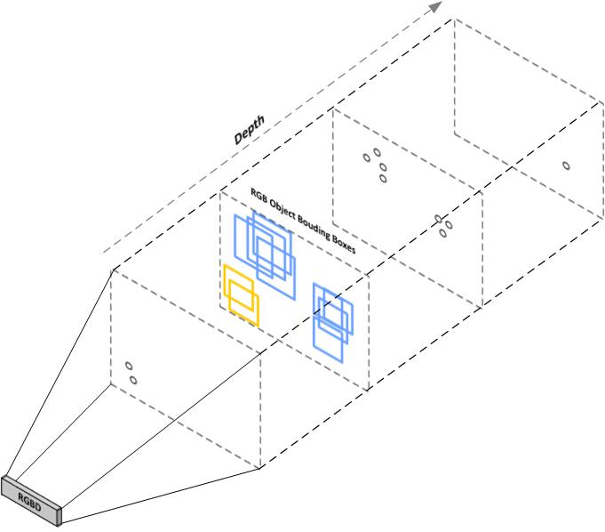
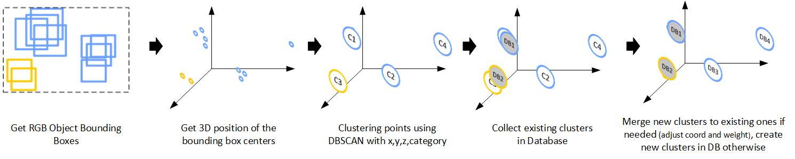
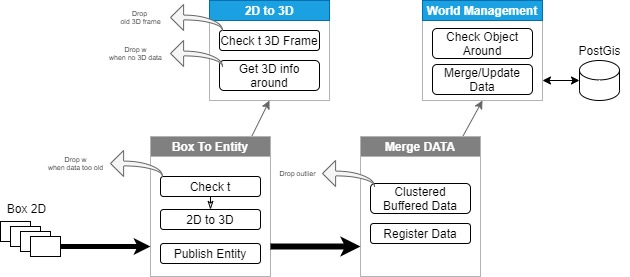

# world_mng

## 1. Description
This package manages spatial information of a given world.
Information is collected from multiples sources:
- manual interest point add (through ros services, e.g observation point)
- detected objects.

Objects can be detected through CNN (e.g Yolo Darknet), and resulted bounding boxes are converted into 3D world points. In the current work we assume that RGBD camera is used.

The following nodes are used :
  - Package `convert_2d_to_3d`
    - Node `convert_2d_to_3d` : cpp node in charge of finding depth of a point (x,y in rgb frame). this node collects the PCL frame and, when the service is called, take the average of depths into a given perimeter (e.g scare of 10 pixel around the given coordinate). A 3D point is return on a given frame reference (e.g /map)
    - Node `box_to_entity.py`:  collect detected object bounding boxes, ask `convert_2d_to_3d` service to get depth, create list of `entity` and publish then into a topic
    - Node `merge_data`: collect entity list from the given topics, create entity clusters through  a DBSCAN, add ask service to add cluster to database. 
  - Package `world_manager`:
    - Node `world_mng`: Create a link to the PostGIS database, register or update object clusters if needed

The following workflow is done:

The ros nodes work as follow:

## 2. Authors
* Jacques Saraydaryan

## 3. How to quote
F. Jumel, J. Saraydaryan, R. Leber, L. Matignon, E. Lombardi, C. Wolf and O. Simonin,”Context Aware Robot Architecture, Application to the Robocup@Home Challenge”, RoboCup Symposium 2018

